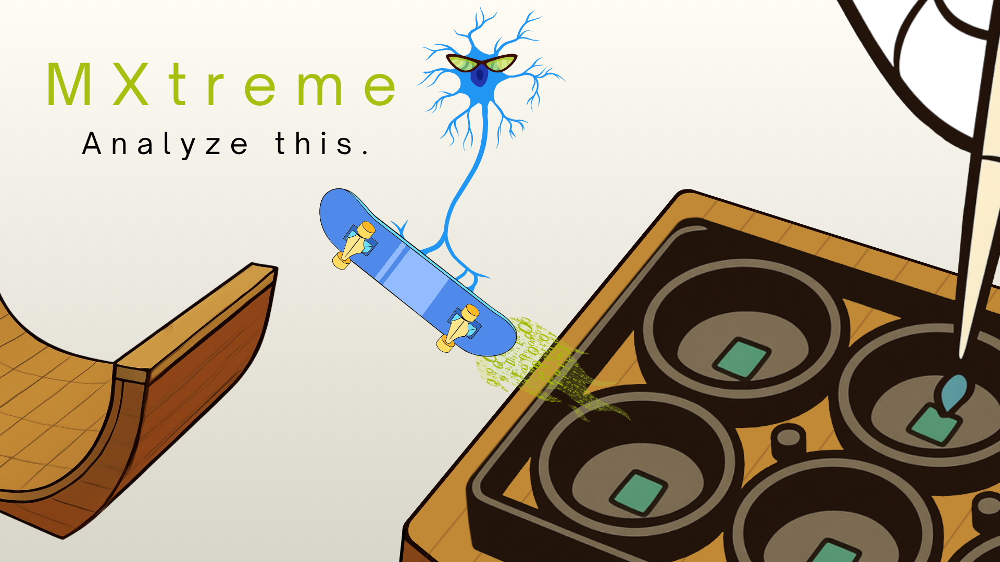

## Requirements

- **Python 3.12+**
- **[uv](https://docs.astral.sh/uv/)** for development (environment + dependency management). End users installing the published package only need pip.

## Installation (users)

```bash
pip install mxtreme
```

```python
import mxtreme
# ...
```

## Development setup

MXtreme uses [uv](https://docs.astral.sh/uv/) to manage a project-local virtual environment and a committed lock file, so every contributor works against an identical dependency stack.

### 1. Install uv

```bash
curl -LsSf https://astral.sh/uv/install.sh | sh
```

Restart your shell afterward so `uv` is on your `PATH`.

### 2. Clone and sync

```bash
git clone <repo-url>
cd MXtreme
uv python pin 3.12   # only needed once; respects .python-version if already present
uv sync
```

`uv sync` does everything in one step:

- creates a project-local `.venv/` next to `pyproject.toml`,
- installs MXtreme **editable** (an `import mxtreme` resolves to `src/mxtreme/`, so your edits take effect live),
- installs the `dev` dependency group (test, lint, and notebook tooling),
- resolves and writes `uv.lock` with exact, reproducible versions.

The `.venv/` is created inside the project and is git-ignored automatically — do not commit it. `uv.lock` **is** committed.

### 3. Run things through uv

There's no environment to activate. Prefix commands with `uv run` and they execute inside `.venv`:

```bash
uv run python -c "import mxtreme; print(mxtreme.__file__)"   # should point into src/
uv run pytest
uv run ruff check .
```

> **Note:** don't run a bare `python`/`pip` — that hits your system interpreter, not the project env. Always go through `uv run` (or activate `.venv` manually if you prefer).

## Examples and notebooks

Example scripts and notebooks live in `examples/` at the repository root. Because MXtreme is installed editable, anything there can `import mxtreme` regardless of where it sits, and it resolves to your live `src/` tree. The `examples/` folder is outside `src/`, so it is never packaged into the published wheel.

Run an example script:

```bash
uv run python examples/demo.py
```

Work in notebooks with the registered kernel (points at `.venv`):

```bash
uv run python -m ipykernel install --user --name mxtreme --display-name "MXtreme (uv)"
uv run jupyter lab
```

Example-only dependencies (plotting libraries, etc.) belong in the `examples` dependency group, not in the core dependencies. Install them with:

```bash
uv sync --group examples
```

When iterating on the library from inside a notebook, enable autoreload so `src/` edits are picked up without restarting the kernel:

```python
%load_ext autoreload
%autoreload 2
```

## Contributing

1. **Create a branch** off the main branch for your change.
2. **Sync the environment** — `uv sync` after pulling, so your dependencies match the lock file.
3. **Make your changes** in `src/mxtreme/`, with tests alongside.
4. **Run the checks locally** before opening a pull request:

   ```bash
   uv run pytest
   uv run ruff check .
   uv run ruff format --check .
   ```

5. **Open a pull request** describing the change and the reasoning behind it.

### Adding or updating dependencies

Edit dependencies through uv so `pyproject.toml` and `uv.lock` stay in sync:

```bash
uv add <package>                 # runtime dependency
uv add --group dev <package>     # dev-only tooling
uv add --group examples <package># example/notebook-only
uv remove <package>
```

Commit both `pyproject.toml` and `uv.lock` together. To bump versions deliberately:

```bash
uv sync --upgrade                 # everything, within pyproject.toml constraints
uv sync --upgrade-package pandas  # a single package
```

### A note on version floors

Runtime dependencies are declared as lower bounds (e.g. `pandas>=2.0`, `numpy>=1.24`) so the library installs alongside whatever a consumer already has. A fresh resolve therefore pulls the newest compatible majors, which can differ from what earlier work was tested against — pandas 3.x in particular carries real breaking changes. The committed `uv.lock` pins exact versions for development and CI so this doesn't drift silently. When bumping a floor, run the checks against the new stack before committing the bump:

```bash
uv sync --upgrade-package <package>
uv run pytest
```

### Continuous integration

CI installs from the lock file in strict mode so a stale lock fails the build instead of silently re-resolving:

```bash
uv sync --locked
uv run pytest
uv run ruff check .
```

Ideally the test matrix runs against both the oldest supported and the latest allowed versions of the key dependencies, so breakage from a new major surfaces in CI rather than downstream.

## Project layout

```
MXtreme/
├── src/mxtreme/          # the package (this is what ships)
├── examples/             # demo scripts and notebooks (dev only)
├── testing/              # pytest suites
├── pyproject.toml        # package metadata + dependencies
├── uv.lock               # exact resolved versions (committed)
├── .python-version       # dev interpreter (3.12)
└── README.md
```